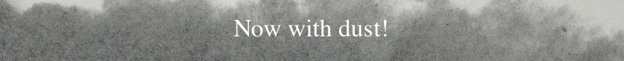

.. NDSPMHD documentation master file, created by
   sphinx-quickstart on Thu Oct 26 2023.
   You can adapt this file completely to your liking, but it should at least
   contain the root `toctree` directive.

Welcome to NDSPMHD's documentation!
===================================

.. toctree::
   :maxdepth: 2
   :caption: Contents:

   about
   install
   examples
   tutorial
   references

Indices and tables
==================

* :ref:`genindex`
* :ref:`modindex`
* :ref:`search`

